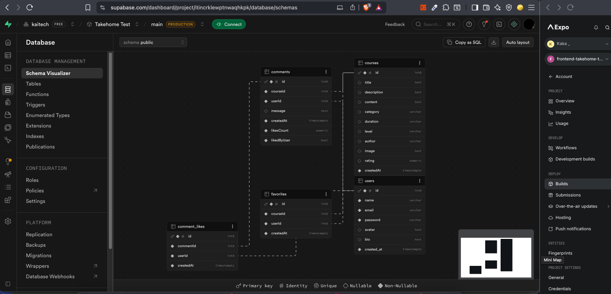

# Course Learning App - React Native (Expo)

A modern mobile application for course management built with **Expo Router**, **React Native Paper**, and **TailwindCSS**. This app features a complete learning ecosystem including course discovery, favorite management, and an interactive comment system.

## Key Features

### 🔐 Authentication

- **Login**: Secure access via email & password.
- **Register**: Create an account with **Name, Email, Password, and Bio**.

### 📱 Main Navigation (Tab Navigation)

- **Home**: 
  - List card courses with **Infinite Scroll**.
  - Advanced filtering by **Title** & **Category**.
  - Pull-to-refresh support.
  - Direct access to Course Detail.
- **Favorite**: 
  - List of saved courses.
  - Flexible deletion: **Delete by Course** or **Delete All**.
  - Instant redirect to Course Detail.
- **Profile**: 
  - Display user profile data.
  - **Update Data**: Handle changes for Avatar, Name, Bio, and Email.
  - **Security**: Forced relogin if the email address is updated.
  - **Theme Switcher**: Dark/Light mode toggle stored in Context.
  - **Sign Out** user, redirect to Login Screen.

### 📚 Course Detail

- Detailed course information based on Selected ID.
- **Favorite System**: Toggle save/unsave courses.
- **Comment CRUD**: Create, Read, Update, and Delete your own comments.
- **Engagement**: Like system for comments.

---

## 🛠️ Tech Stack & Libraries

- **Framework**: Expo (React Native)
- **UI Framework**: [React Native Paper](https://reactnativepaper.com/) (Base components)
- **Styling**: [TailwindCSS / NativeWind](https://www.nativewind.dev/)
- **Icons**: `@expo/vector-icons`
- **Storage**: `@react-native-async-storage/async-storage`
- **Media**: `expo-image-picker` (Handle avatar selection)
- **UX**: 
  - `expo-splash-screen` (Loading management)
  - `expo-status-bar` (Theme-aware status bar)
  - `react-native-toast-message` (Interactive alerts)
- **Updates**: `expo-updates` (OTA Updates without rebuild)
- **Language**: TypeScript (Type safety)

---

## 🧠 Project Architecture

### State Management

- **AuthContext**: Global state for User Session and Theme selection (Dark/Light).
- **Local State**: Standard React `useState` for Courses, Favorites, and Comments logic.

### Assumptions Made

- **Like Logic**: For the comment section, `likedByUser` is handled dynamically. Since a single comment can be liked by >1 participants, a simple boolean from the initial fetch is insufficient without individual user context validation.
- **Database Choice**: Used **Supabase** via **Node.js Express** instead of MockAPI to avoid table generation limitations and ensure robust data relationships.

### Improvements Implemented

- **Owner-Based Actions**: Edit & Delete restricted to own comments.
- **Developer Experience**: Full **Import Aliases** (`@/`*) implementation.
- **Data Fetching**: Pull-to-refresh & Infinite Scroll for optimized performance, integrate with api.
- **Validation**: Clean form validation for Login, Register, and Profile updates.

---

## 🌐 API Reference

**Base URL**: `https://frontend-takehome-test-kaisa.vercel.app/api`  
**Backend Source**: [Express API on GitHub](https://github.com/kai15/frontend-takehome-test-kaisa/tree/main/api)
**Schema**: 


### 1. Users & Auth

- **Register** (`POST /users`)
  - Payload: `{ "name", "email", "password", "bio" }`
- **Login** (`POST /login`)
  - Payload: `{ "email", "password" }`
- **Update Profile** (`PATCH /users`)
  - Payload: `{ "name", "email", "avatar", "bio" }`
- **Upload Image** (`POST /upload`)
  - Payload: `{ "base64", "userId" }`

### 2. Courses

- **All Courses** (`GET /courses?page=1&limit=10&category=&search=`)
- **Course by ID** (`GET /courses?courseId={id}`)

### 3. Comments

- **Get Comments** (`GET /comments?courseId={id}`)
- **Add Comment** (`POST /comments`)
  - Payload: `{ "courseId", "userId", "message" }`
- **Edit Message** (`PATCH /comments`)
  - Payload: `{ "id", "userId", "message" }`
- **Like Comment** (`PATCH /comments`)
  - Payload: `{ "id", "userId" }`
- **Delete Comment** (`DELETE /comments?id={id}&userId={id}`)

### 4. Favorites

- **Get Favorites** (`GET /favorites?userId={id}`)
- **Check Specific Favorite** (`GET /favorites?courseId={id}&userId={id}`)
- **Add Favorite** (`POST /favorites`)
  - Payload: `{ "courseId", "userId" }`
- **Update Favorite** (`PATCH /favorites`)
  - Payload: `{ "courseId", "userId" }`
- **Delete Single** (`DELETE /favorites?id={id}&userId={id}`)
- **Delete All** (`DELETE /favorites?id=0&userId={id}`)

---

## ⚙️ Installation

1. `git clone <repo-url>`
2. `npm install`
3. Create `.env`: `EXPO_PUBLIC_API_URL=https://frontend-takehome-test-kaisa.vercel.app/api`
4. `npx expo start`

## 📦 Deployment (EAS)

This apps using **Expo Application Services (EAS)** for Build and Update.

### 1. Configuration EAS Build (Android APK)

Create APK Preview/Internal Distribution:

```bash
# Login Expo
npx eas login

# config
npx eas build:configure

# Build APK Preview
npx eas build --profile preview --platform android

# Update
npx eas update --branch preview --message "Update UI and bug fixes"

---
```

**APK in folder**: `/assets/apk` - `apk-build-preview-v1.apk`

